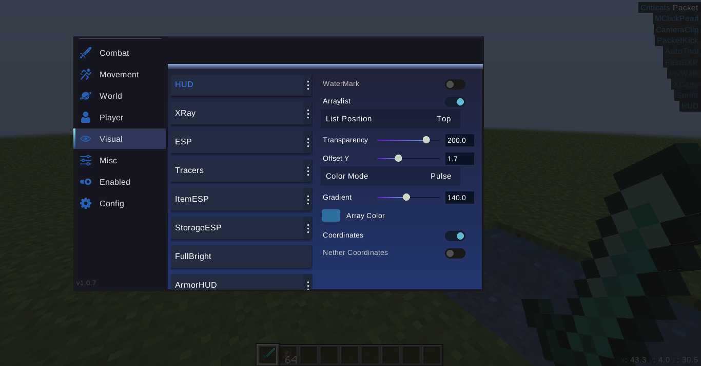

# Infinity
Hacked client for Minecraft Fabric 1.17/1.17.1

This is the legacy code of the Infinity project, so there's a lot of shit there)

## How Install
1. Download the [Fabric API](https://www.curseforge.com/minecraft/mc-mods/fabric-api/download/3516424)
2. Move Infinity and Fabric Api to the `.minecraft/mods/` folder
3. Select Fabric-1.17.1 version and run

## General
- Commands: -help
- The menu opens with the button: GRAVE

#### MENU

Special thanks to [GishReloaded](https://github.com/GishReloaded) for the help

[Infinity Prime Version](https://vk.com/whyuleet)

[Discord](https://discord.gg/JT9eAsVVH4)